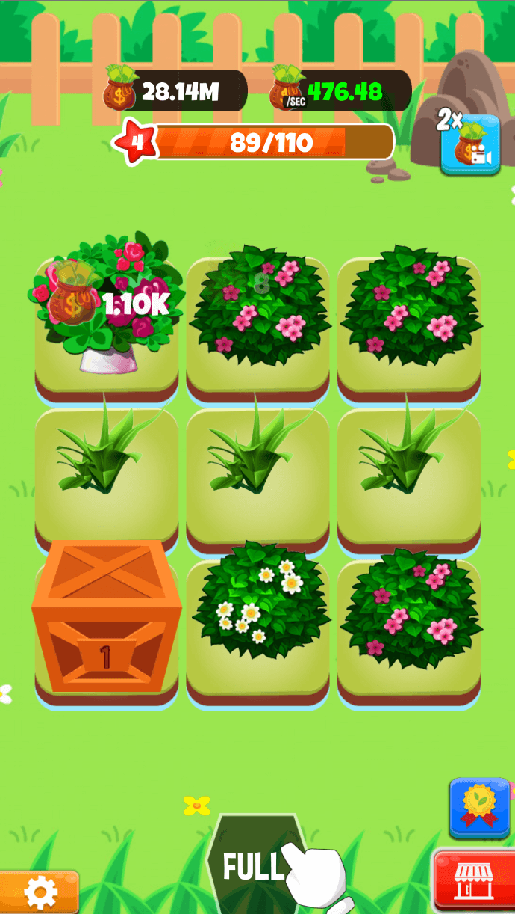
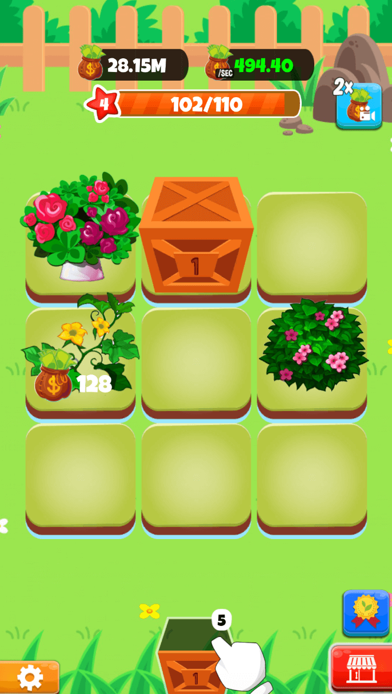
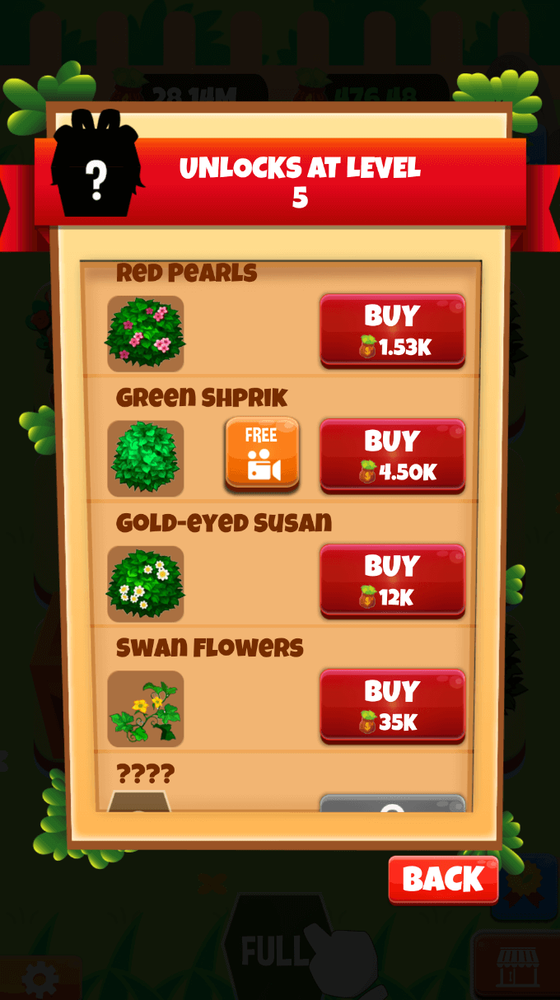
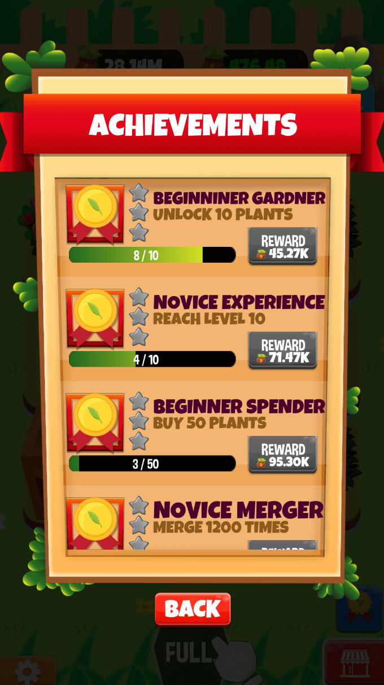

# Merge-Plant

  
  
  
  

## Description
  Merge Plant is a complete project template that will help you create a great idle game. You only need change the graphic, advertising ID and publish on Google Play or App Store . The project includes many game features like Admob, Unity Ads, In App Purchase and Firebase Analytics. The project use Unity new version (2021.x) so your game has highest performance and support all mobile device generation

 

## How to play

  * Create your gardens and merge your plants to make them better and big to earn more XP , Experience and levels
  * The higher levels you are on, the more space you will unlock Three or more adjacent cards of the same number will trigger a triple-clear, and then merged to a new card with its number plus one.
  * Higher Levels in the game will give you more harvested land to work on to develop your garden in a beautiful and big garden  
  * This game requires attention to ensure that you are developing the garden and merging your plants with your full potential. 
 

## Features
  * Easy to play
  * Simple, intuitive and easy to use controls 
  * Easy, addictive and very challenging 
  * Money and Time to get you going
  * In App purchase (Remove Ads & Coin Packages)
  * Firebase Analytics
  
